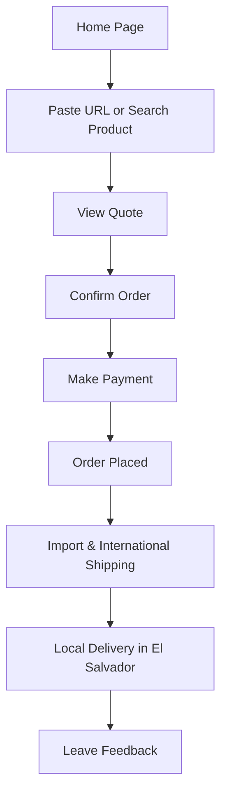

# 🛒 **PRD – "AmazonSV" (Working Title)**  
### Web App for Buying and Importing Amazon Products to El Salvador

---

## 📘 1. Executive Summary

**AmazonSV** is a web platform that allows users in El Salvador to **buy products from Amazon.com**, even though Amazon does not officially operate in the country.  
The app acts as a **trusted intermediary**, managing the entire process:
- **Purchasing** the product on Amazon on behalf of the customer.
- **Importing and handling customs clearance**.
- **Delivering locally** to the customer’s door.

**Goal:** Make international shopping accessible, transparent, and reliable for Salvadorans.

---

## 🗾 2. Product Objectives

| Type | Objective |
|------|------------|
| 🎯 Primary | Enable Salvadorans to buy from Amazon without needing an international card or US address. |
| 🚚 Secondary | Simplify the logistics experience: tracking, import, and delivery. |
| 💵 Tertiary | Monetize through service fees, import costs, and premium subscriptions. |

---

## 👤 3. Target Audience

| Segment | Characteristics |
|----------|----------------|
| **Young buyers (18–35)** | Digital natives seeking better prices on gadgets, fashion, and books. |
| **Professionals and families** | Prefer convenience and trustworthy service for hard-to-find items. |
| **Entrepreneurs / resellers** | Buy in bulk for resale or business use. |

---

## 🧩 4. Value Proposition

> “Shop on Amazon without worrying about customs, payments, or shipping. We handle everything for you.”

**Core Pillars:**
- ✅ Simple purchase: paste any Amazon link.  
- 🚚 Guaranteed delivery to your home.  
- 💳 Local payments (national cards, bank transfers, or cash).  
- 🔍 Transparent tracking and order status.  
- 📏 Automatic price breakdown (product + import + service).  

---

## ⚙️ 5. Key Features

### 🧱 MVP (Phase 1)
1. **Product search/import**  
   - Users can paste a URL or search for items (via Amazon scraper API).
2. **Real-time quote**  
   - Instant calculation of total cost: product + shipping + taxes + commission.
3. **Checkout and payment**  
   - Local payment support: credit/debit, Tigo Money, or bank transfer.
4. **Order management**  
   - Statuses: *Ordered → In Transit → Customs → Delivered*.
5. **Notifications and tracking**  
   - Email + push notifications + web dashboard.
6. **Customer support**  
   - Integrated chat or WhatsApp contact.

### 🚀 Phase 2 (Scaling)
- **PrimeSV Membership** (discounts and faster shipping).
- **Referral program**.
- **Smart recommendations**.
- **Order history and invoices**.
- **Local warehouse for faster urban deliveries.**

---

## 🧮 6. User Flow

---

## 🛠️ 7. Technical Architecture (Overview)

| Layer | Technology / Service |
|-------|----------------------|
| **Frontend** | Next.js (Web only) |
| **Backend** | Node.js (NestJS) / Express |
| **Integrations** | Amazon Product API (scraper), PayGate, Twilio, Google Maps, Shippo |
| **Database** | PostgreSQL + Prisma ORM |
| **Infrastructure** | AWS (ECS, S3, CloudFront), CI/CD (GitHub Actions) |
| **Analytics** | Mixpanel / PostHog |
| **Future AI Support** | Chatbot for order tracking and product assistance |

---

## 💰 8. Business Model

| Revenue Stream | Description |
|----------------|-------------|
| **Service Fee** | 8–15% per order depending on size/category. |
| **PrimeSV Membership** | Monthly subscription for discounts and shipping priority. |
| **Import Margin** | Small markup on customs and logistics management. |
| **Affiliate Revenue (optional)** | Amazon affiliate partnership. |

---

## 🔒 9. Legal Considerations

- Compliance with **El Salvador customs regulations (DGA)**.  
- Accurate declaration of imported goods.  
- Transparent return and refund policies.  
- Protection of user data under Salvadoran data privacy law.

---

## 📊 10. Key Metrics (KPIs)

| Metric | Target |
|--------|---------|
| CAC | <$10 USD |
| Average Delivery Time | < 15 days |
| Repeat Purchase Rate | >30% |
| NPS | >70 |
| Conversion Rate | >4% |

---

## 🗓 11. Timeline (Phase 1)

| Month | Milestone |
|--------|------------|
| 1–2 | UX/UI Design + Scraper Feasibility Validation |
| 3–4 | Functional MVP (quoting + local payments) |
| 5 | Beta testing + logistics pilots |
| 6 | Public Launch (Web Platform) |

---

## 🧠 12. Risks & Mitigations

| Risk | Mitigation |
|------|-------------|
| Amazon API restrictions | Use scraping + affiliate backup. |
| Customs delays | Partnerships with local freight forwarders. |
| High logistics cost | Negotiate courier partnerships (DHL, Aerocasillas). |
| Package loss | Insurance and verified tracking system. |

---

## 🌟 13. Unique Differentiators

Unlike typical courier intermediaries, **AmazonSV** offers:
- A **fully digital, automated shopping experience**.  
- **Transparent final pricing** before checkout.  
- **Local payment options** and customer service in Spanish.  
- **Reliable delivery timelines** with end-to-end visibility.

---

